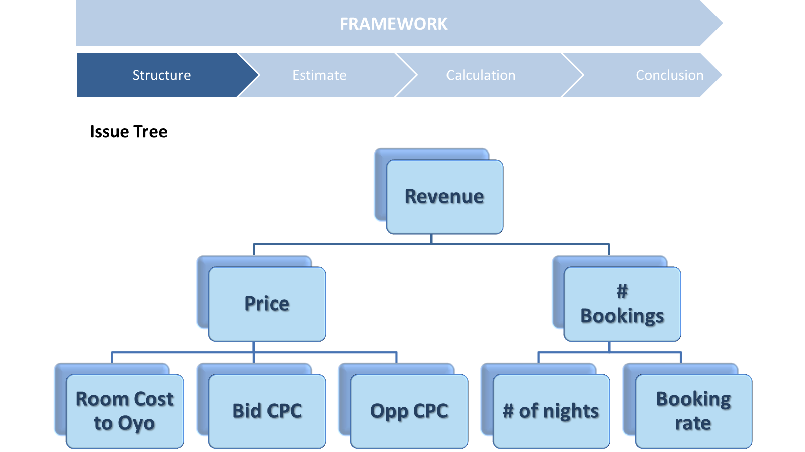
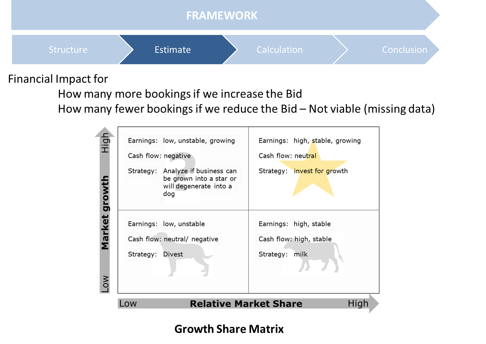
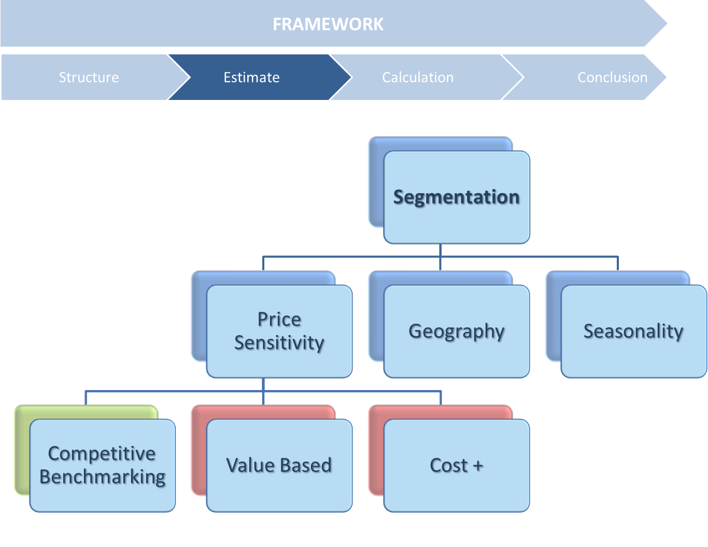

## Oyo Case
### Revenue Maximization


## Contents

* Problem Statement
* Framework
* Structure
* Estimation
* Calculation
* Conclusion


### Problem Statement

Oyo rooms advertise their facilities to a Network Agency, `Trivago`, who charge them at a Bid CPC for each ad. A combination of `Bid CPC` and Price of facility determines how highly the ad is placed. Oyo wants to improve its Bids to achieve maximum revenue with Trivago.


### Framework

Even before the problem is considered, we must explore the boundary conditions to evaluate Revenue maximization exercise can make sense. 


```{r Importing Data, echo = FALSE}
require("readr")
require(tidyverse)

oyo_v1_2 <- read_csv("Repo/Oyo_v1.2.csv", 
    col_types = cols(`Booking Value Index` = col_factor(levels = c("High", 
        "Above Average", "Average", "Below Average", 
        "Low"))))
#View(Oyo_v1_2)


```

We assume the following structure for the Revenue system: 



One of the ways, Oyo can calssify its properties is the GE Growth-Revenue matrix. 
 


There is question mark on facilities that have not been evenly utilized. They should be shifted to revenue generating to the Star section.


```{r Data Exploration, echo = TRUE}
require("ggplot2")
# counts
ggplot(oyo_v1_2, aes(x=oyo_v1_2$`Booking Value Index`)) +
  geom_bar()


```


With the given distribution, it makes sense that some *Average* and *Below Average* bookings may be converted to more profitable tiers. This is our *Hypothesis*. In our discussion, we would either prove the null Hypothesis or otherwise.


Consider that Trivago's market is highly price sensitve. Additionally, a percentage change in Booking Value of an Oyo facility would result in larger cost than increasing the Bid value (which can be gathered from the `Opportunity CPC`). In terms of Pricing strategies, Competitive Beanchmarking is the applicable method here.




### Estimation

We would need to estimate the *minimum change in bid cpc* that drives maximum revenue. 

Therefore, the new bid value = `Opportunity CPC` + `Bid CPC`

Accordingly, the impressions would change from `Hotel Impressions` to `Maximum Possible Impressions` 

Finally, we would need a surrogate for `Booking rate` that will associate with the trend of improved Revenue -- `Response rate`. It should consider the numerical and categorical factors within the data set.


### Calculation

First, we calculate the Bid Price, Booking Availability, Maximum Impressions, and Maximum Booking Potential.

`Maximum Booking Potential` is the maximum number of days that can be booked at the Oyo facility. It is calculated as the minimum of the two:
* Days left in the month
* Maximum days that can be booked from improvement in advertisement

```{r Add the biased bid Price and Maximum Quantity of Booking, echo = TRUE }
require(dplyr)

oyo_v1_2 <- tbl_df(oyo_v1_2)
# glimpse(oyo_v1_2)


o1 <- mutate(oyo_v1_2,
             Always_Win_Bid_CPC = oyo_v1_2$`Bid CPC` + oyo_v1_2$`Opportunity CPC`,
             Booking_Availability_in_the_month = 30 - oyo_v1_2$Bookings,
             Max_Possible_Impressions = oyo_v1_2$`Hotel Impr` + oyo_v1_2$`Max Potential`,
             Max_Booking_Potential = floor(oyo_v1_2$`Max Potential` * (oyo_v1_2$Bookings / oyo_v1_2$`Hotel Impr` ))
             )
# glimpse(o1)
```


First, we need a cleaner, relevant dataset. The twin objecctives here are:
* Create a dataset that can be used to train a model
* Create a Look-up table to identify the relevant sections 

```{r Data Preparation}
#Creating a relevant data set
o1_test <- select(o1, PartnerRef, `Bid CPC`, `Opportunity CPC`, `Hotel Impr`, Clicks, `Avg. CPC`, `Top Pos Share`,`Impr Share`, `Max Potential`, Max_Booking_Potential, `Gross Rev`,`Booking Rate`, `Booking Value Index`, Booking_Availability_in_the_month  )
# glimpse(o1_test)

# Selecting rows without any missing values
o1_test <- o1_test[complete.cases(o1_test), ]

# Extract Partner Reference COlumn

# Copying Reference COlumn
o1_test_partnerRef <- o1_test$PartnerRef

# Selecting tbl minus Partner Column
o1_test <- select(o1_test, `Bid CPC`, `Opportunity CPC`, `Hotel Impr`, Clicks, `Avg. CPC`, `Top Pos Share`,`Impr Share`, `Max Potential`, Max_Booking_Potential,`Gross Rev`,`Booking Rate`, `Booking Value Index` , Booking_Availability_in_the_month )
# glimpse(o1_test)
```


`Response Rate` would be our closest surrogate to the `Booking rate`. It would signify how well the customers might react to the new ad campgain by Oyo.

In this exercise, we will use 10-fold CrossValidation method as used in `caret` package. Model fitment is tested by in-sample RMSE in this case.

```{r Predict a response rate}

require("caret")


#set seed for reproducability 
set.seed(42)

# Fit lm model using 10-fold CV: model
foomodel <- train(
  `Booking Rate` ~ ., o1_test,
  method = "lm",
  trControl = trainControl(
    method = "cv", number = 10,
    verboseIter = TRUE
  )
)

predicted_response_rate <- predict(foomodel, o1_test, type = "raw")
actual <-  o1_test$`Booking Rate`
rmse_in_sample <- sqrt(mean((actual-predicted_response_rate)^2))
rmse_in_sample

o1_test$Predicted_Response_Rate <- abs(predicted_response_rate)
```

Considering that we have received a good, low Root Mean Square Errror of 0.067, we combine the dataset again.

```{r Redrawing the Dataset to include reference}

# Reattaching the Partner Reference Column
o1_test$PartnerRef <-  o1_test_partnerRef
```

```{r frq dist new values, echo= FALSE, eval=FALSE}
ggplot(o1_test, aes(x= o1_test$Booking_Availability_in_the_month)) + geom_bar()

ggplot(o1_test, aes(x= o1_test$`Gross Rev`)) + geom_bar()

# ggplot(o1_test, aes(x= o1_test$Possible_Bookings)) + geom_bar()


```

Now, we calculate the revenue, cost and Profit from the exercise.

```{r Calculate Cost Revenue and Profit}

#glimpse(o1_test)
o1_test <- mutate(o1_test,
             Increased_Cost = (o1_test$`Max Potential`) * (o1_test$`Bid CPC`+ o1_test$`Opportunity CPC`),
             Possible_Bookings = pmin(o1_test$Max_Booking_Potential, o1_test$Booking_Availability_in_the_month),
             Increased_Revenue =  Possible_Bookings * o1_test$`Gross Rev`,
             Increased_Profit = Increased_Revenue - Increased_Cost
             )
# head(o1_test$`Gross Rev`)
# newData_view <- select(o1_test,Increased_Profit, Increased_Cost, Increased_Revenue)
# head(newData_view)
```

The entire data set is now sorted by Profits. After that, we have distributed the facilitiesin 10 groups. The final result is stoed in `Uplift table`


```{r Sort tbl in deciles}

# ntile

o1_test %>% mutate(decile = ntile(desc(Increased_Profit), 10)) -> oyo_deciles 
head(oyo_deciles)

oyo_deciles %>% group_by(decile) %>% # Group by decile
  summarize(response_rate_percent = round((mean(Predicted_Response_Rate)*100),2), 
            Profit = sum(Increased_Profit), 
            Cost = sum(Increased_Cost),
            Return_On_Ad_Spend = round(Profit/Cost,2),
            count = n()) -> Uplift_table

Uplift_table

```


## Conclusion

* Oyo should retarget the deciles with positive porfit --  1.
* Response rate is an indicator of better returns. Anything below 4 is not profitable.
* Require Ensamble Algorithms for better RMSE or R2
* Geography based analysis may shift pricing from competitive (low Revenue ? Group) to Stars or Dogs group
* A robust Pricing system (requires more data on Domain Expretise, Seasonality and Time Series Projection)


